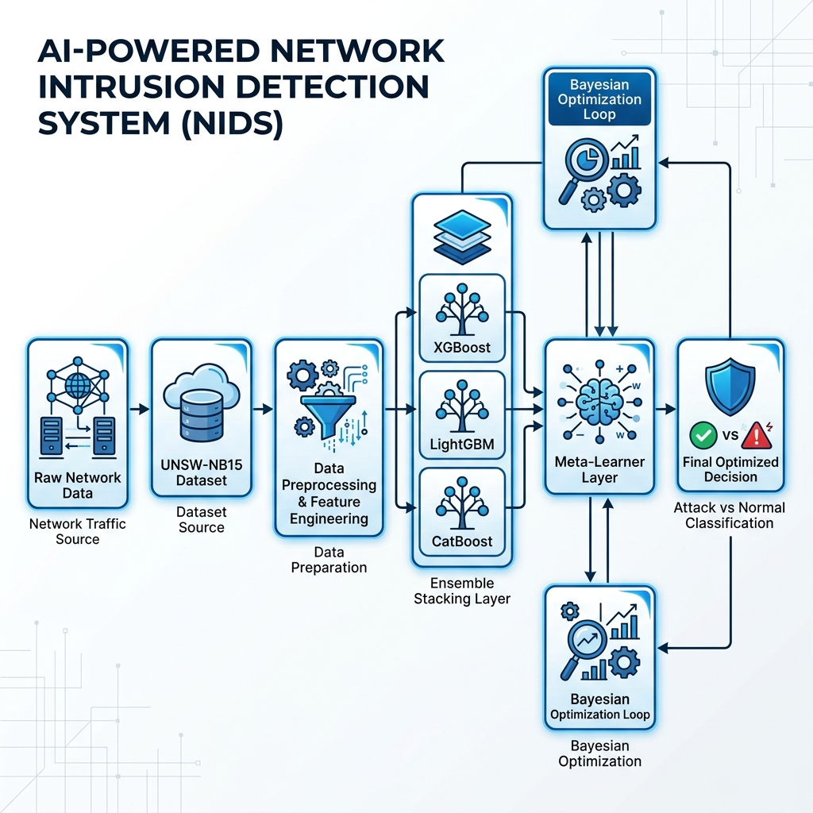

# ✅ UNSW-NB15 Intrusion Detection System (IDS) — Improved via Ensemble & Stacking
### 👨‍🤩 Author: Daniyal Hyder
### 📑 Project Type: Data Science / Machine Learning
### 🐍 Task: Research Paper Improvisation (2025–2026)

---
# 📌 Overview

This project implements and **significantly improves** a machine learning-based Intrusion Detection System (IDS) based on the research paper:

✅ [Frontiers in Computer Science (2025)](https://www.frontiersin.org/journals/computer-science/articles/10.3389/fcomp.2025.1520741/full)

Using the **UNSW-NB15 dataset**:
✅ [UNSW-NB15 Dataset](https://research.unsw.edu.au/projects/unsw-nb15-dataset)

---
# 🐍 Objective

✅ Reproduce the baseline IDS from the paper  
✅ Identify limitations in standalone models  
✅ Apply **Advanced Ensemble Stacking** & **Bayesian Optimization**  
✅ Achieve **90.10% accuracy** (a +3% improvement over baseline)

---
# 🔄 System Workflow

Our improved pipeline transforms raw network data into high-precision security alerts using a multi-layer stacking architecture.



---
# 🦖 Final Results Comparison

| Metric | Baseline Paper | This Project | Improvement |
| :--- | :---: | :---: | :---: |
| **Accuracy** | ~87.0% | **90.10%** | □ **+3.10%** |
| **F1-Score** | ~0.896 | **0.915** | □ **+0.019** |
| **ROC-AUC** | ~0.900 | **0.983** | □ **+0.083** |

---
# 💻 Project Documentation

For a deep dive into the technical details and performance analysis, please refer to the following documents:

1.  📔 **[Difference Log](difference_log.md)**: Detailed comparison of baseline vs. our improvements with step-by-step ablation study.
2.  📔 **[IEEE Format Report](report/IEEE_Report.md)**: A complete research report following IEEE standards, including SHAP/LIME analysis.

---
# 💻 Project Structure

```
├── Improved_IDS_UNSW_NB15.ipynb     # Main Research Notebook
├── README.md                        # Project Overview
├── difference_log.md                # Performance Comparison & Workflow
└── report/
    ├── IEEE_Report.md               # Professional IEEE Report
    └── images/                      # Extracted Plots & Diagrams
        ├── workflow_diagram.png     # System Architecture
        ├── ablation_study_bars.png  # Improvement Stages
        ├── roc_pr_comparison.png    # Performance Curves
        ├── shap_importance.png      # Global Interpretability
        └── lime_explanation.png     # Local Interpretability
```

---
# ⚙️ Technologies Used

*   **Python 3.12**
*   **Ensemble**: XGBoost, LightGBM, CatBoost
*   **Optimization**: Optuna (Bayesian Optimization)
*   **Balancing**: SMOTETomek
*   **XAI**: SHAP, LIME

---
# 🎓 Conclusion

This project demonstrates that proper engineering improvements—specifically **Ensemble Stacking** and **Decision Threshold Optimization**—can significantly enhance the reliability of Machine Learning systems in cybersecurity contexts.

---
# 🚀 Getting Started

To reproduce the results, follow these steps:

1. Clone the repository: `git clone https://github.com/daniyal3029/Network-Intrusion-Detection-UNSW-NB15-Ensemble.git`
2. Install required libraries: `pip install -r requirements.txt`
3. Run the Jupyter Notebook: `jupyter notebook Improved_IDS_UNSW_NB15.ipynb`

Note: Make sure to install the required libraries and run the Jupyter Notebook in the correct environment.

---
# 💻 Badges

[](https://www.python.org/downloads/release/python-312/)
[](https://opensource.org/licenses/MIT)
