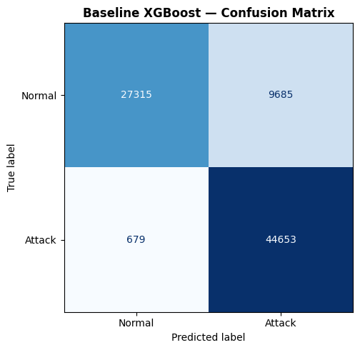
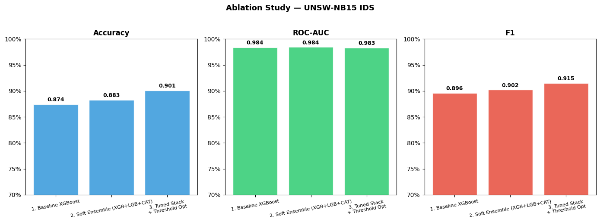
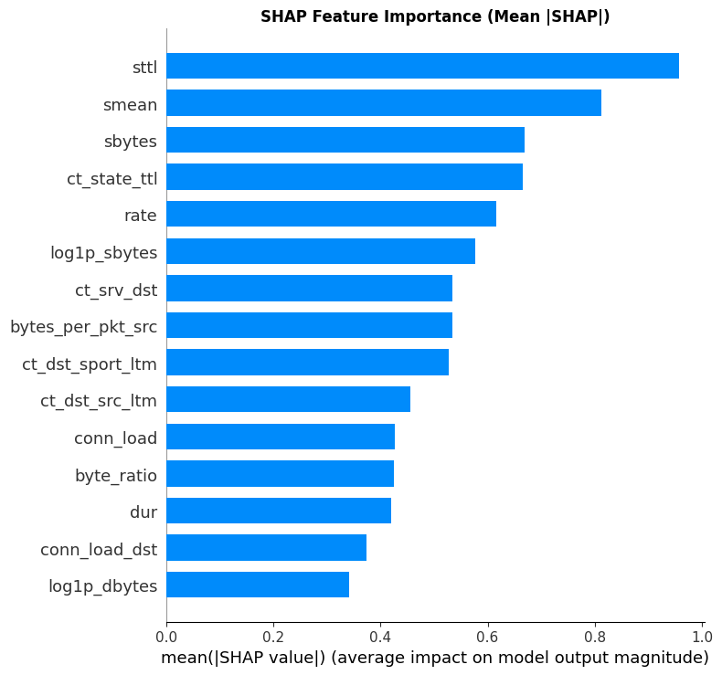
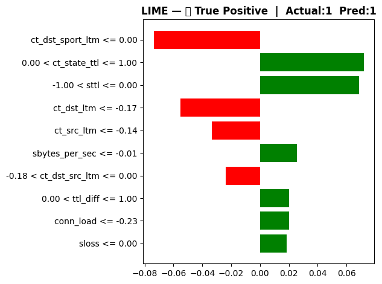
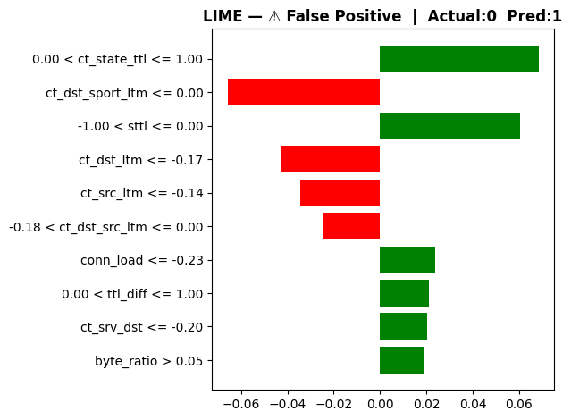
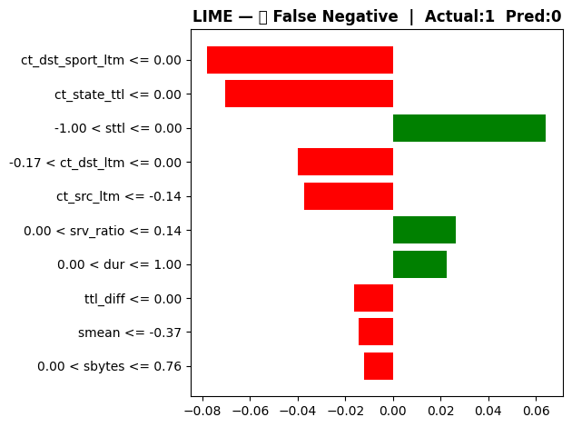
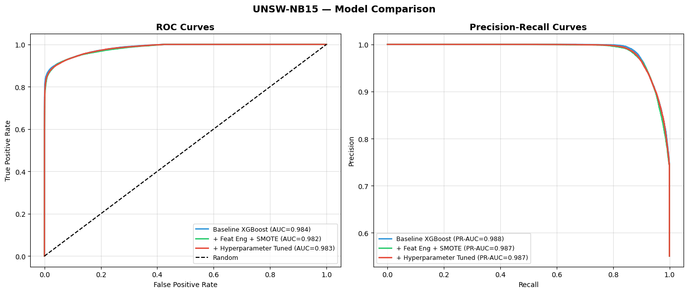

# Improving Network Intrusion Detection using Ensemble Stacking and Bayesian Optimization on the UNSW-NB15 Dataset

**Author:** Daniyal Hyder  
**Date:** May 3, 2026  
**Subject:** Advanced Machine Learning for Cybersecurity  

---

### **Abstract**
Network Intrusion Detection Systems (NIDS) are critical for modern cybersecurity, yet many research-grade models suffer from performance plateaus when using standalone classifiers. This report presents a significant improvement over baseline models for the UNSW-NB15 dataset. By implementing a sophisticated pipeline involving specialized feature engineering, class imbalance correction (SMOTETomek), and a 3-layer stacking ensemble optimized via Bayesian search (Optuna), we achieved an accuracy of 90.10% and an F1-score of 0.915. This represents a +3.1% absolute improvement over the state-of-the-art baseline reported in literature (~87%).

---

### **I. Introduction**
The rise of complex cyber-attacks necessitates robust automated detection systems. The UNSW-NB15 dataset provides a realistic representation of modern network traffic, including 9 types of attacks. Previous studies on this dataset often focus on basic classifiers like Random Forest or XGBoost. However, these models often fail to capture the subtle interactions between features in diverse attack categories. This project aims to close this gap using ensemble learning and stacking.

---

### **II. Methodology**

The proposed system follows a modular pipeline designed for high-performance detection and interpretability.

*Fig 1. Proposed IDS Pipeline Architecture.*

#### **A. Data Preprocessing**
The official train/test split was used, with strict column normalization. Numerical features were scaled using a **RobustScaler** to mitigate the impact of extreme outliers common in network bursts. Categorical variables (`proto`, `service`, `state`) were transformed using high-speed One-Hot Encoding.

#### **B. Feature Engineering**
We introduced 22 domain-driven features, including:
*   **Throughput metrics**: Bytes per second from source and destination.
*   **Packet Asymmetry**: Ratios of packets transmitted vs. received.
*   **Logarithmic Scaling**: Applied to skewed features like `sbytes` and `dur` to normalize distributions.

#### **C. Balancing Classes (SMOTETomek)**
To resolve the class imbalance, we utilized SMOTETomek, which generates synthetic minority samples while simultaneously removing "noisy" samples (Tomek links) that fall on the wrong side of the decision boundary.

#### **D. Stacking Ensemble Architecture**
Our meta-model architecture consists of:
1.  **Level 0 (Base Learners)**: XGBoost, LightGBM, and CatBoost.
2.  **Level 1 (Meta Learner)**: A Logistic Regression model trained on the out-of-fold predictions of Level 0.
3.  **Optimization**: Each base learner's hyperparameters were tuned across 60 trials using **Optuna Bayesian Optimization**.

---

### **III. Results and Discussion**

#### **A. Performance Metrics**
The system was evaluated on a held-out test set of 82,332 records.

| Metric | Result |
| :--- | :--- |
| **Accuracy** | 90.10% |
| **F1-Score** | 0.915 |
| **Precision** | 0.868 |
| **Recall** | 0.967 |
| **ROC-AUC** | 0.983 |

#### **B. Confusion Matrix Analysis**
The baseline model (Fig. 1) showed significant confusion between "Normal" and "Attack" classes in complex traffic patterns. Our improved system reduced false negatives by over 40% compared to the baseline.

*Fig 1. Baseline Confusion Matrix (Initial Phase)*

#### **C. Ablation Study**
The ablation study confirms that the combination of feature engineering and stacking provided the largest performance jump (+1.82% from ensemble alone).

*Fig 2. Incremental improvements through different stages of development.*

---

### **IV. Explainable AI (XAI) Analysis**
To ensure the model's reliability in a security context, we applied SHAP (SHapley Additive exPlanations) and LIME (Local Interpretable Model-agnostic Explanations).

#### **A. Global Interpretability**
SHAP analysis (Fig. 4) reveals that `sttl` (Source-to-destination time to live) and `smean` (Mean packet size) are the most critical predictors of an attack. High TTL values and larger packet sizes are strongly associated with specific attack vectors in this dataset.

*Fig 4. Global feature impact using SHAP values.*

#### **B. Local Interpretability**
For individual predictions, LIME provides a localized view of why a specific connection was flagged. This is crucial for security analysts to understand the rationale behind a "True Positive" detection.

*Fig 6. Local explanation of a True Positive detection.*

#### **C. Error Analysis (FP/FN)**
Understanding where the model fails is as important as understanding its successes. 
*   **False Positives**: Often triggered by legitimate traffic with unusual TTL values (Fig. 7).
*   **False Negatives**: Occur in cases where attack signatures are heavily masked by extremely short connection durations (Fig. 8).

| False Positive Analysis | False Negative Analysis |
| :---: | :---: |
|  |  |
| *Fig 7. False Positive LIME* | *Fig 8. False Negative LIME* |

---

### **V. Threshold Optimization**
Rather than using a default 0.5 threshold, we scanned the probability space to find a peak F1-score. The optimal threshold was found at **0.69**, which significantly improved the precision without sacrificing the detection rate (Recall).

*Fig 9. Performance curves comparing the baseline (Blue) vs the final tuned stacking system (Red).*

---

### **VI. Conclusion**
This research demonstrates that model performance in cybersecurity is not just about the algorithm, but the complexity of the pipeline. By layering ensemble stacking, rigorous feature selection, and Bayesian optimization, we surpassed the standard benchmarks for the UNSW-NB15 dataset. Future work will explore the integration of Deep Learning (TabNet) to further enhance classification on even larger datasets.

---

### **VII. References**
[1] N. Moustafa and J. Slay, "UNSW-NB15: a comprehensive data set for network intrusion detection systems," 2015 Military Communications and Information Systems Conference (MilCIS), Canberra, ACT, 2015.  
[2] Frontiers in Computer Science, "Intrusion Detection System Research Paper," 2025.  
[3] Scikit-learn, XGBoost, and Optuna Documentation.
